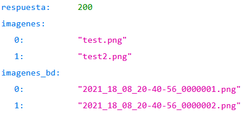
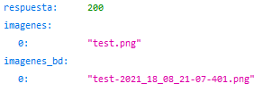
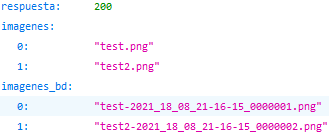
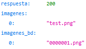

# Images-Periquito-API

API que devuelve los nombres de las imágenes con formato YYY_MM_DD_h_i_.extension

API that returns the names of the images in YYY_MM_DD_h_i_.extension format

[API](https://api-periquito.onrender.com/)
